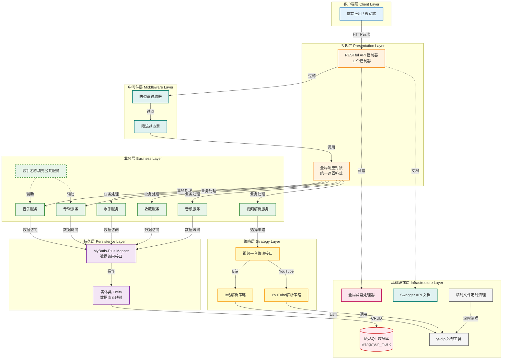

# 网易云音乐项目 (wangyiyun-music)

> 基于 Spring Boot 的网易云音乐后端服务系统

**文档生成时间**: 2026-02-01 15:50:45
**项目版本**: 0.0.1-SNAPSHOT
**技术栈**: Spring Boot 3.1.0 + Java 17 + Maven + MySQL + MyBatis-Plus

---

## 变更记录 (Changelog)

### 2026-02-01
- 增量更新项目 AI 上下文文档
- 新增视频解析模块文档（B站/YouTube视频转音频）
- 新增音频资源安全模块文档（限流 + 防盗链）
- 新增临时文件管理模块文档（定时清理）
- 更新模块结构图（Mermaid）
- 新增模块索引与覆盖率报告
- 统计分析：96 个 Java 文件，11 个控制器，29 个服务类

### 2026-01-30
- 增量更新项目 AI 上下文文档
- 添加音频文件URL映射模块文档
- 生成详细的系统架构图（Mermaid）
- 更新技术栈信息（反映已集成依赖）
- 更新模块索引（反映实际实现状态）
- 添加代码优化示例（歌手名称填充服务）

---

## 项目概览

### 项目愿景
构建一个功能完善的网易云音乐后端服务系统，提供音乐播放、歌手管理、专辑管理、收藏互动、视频转音频等核心功能，采用现代化的分层架构设计。

### 核心功能
- ✅ **音乐管理服务**: 歌曲查询、播放URL获取、音乐列表、音乐详情
- ✅ **歌手管理服务**: 歌手信息查询、歌手作品列表
- ✅ **专辑管理服务**: 专辑信息查询、专辑歌曲列表
- ✅ **收藏管理服务**: 用户收藏歌曲、收藏列表管理
- ✅ **播放记录服务**: 播放历史记录、播放统计
- ✅ **分类标签服务**: 音乐分类、标签管理
- ✅ **音频资源服务**: 音频文件URL映射、支持HTTP Range请求
- ✅ **视频解析服务**: B站/YouTube视频解析并提取音频（基于 yt-dlp）
- ✅ **音频安全服务**: 多维度限流 + 防盗链（Referer/User-Agent/IP黑名单）
- ✅ **临时文件管理**: 定时清理过期临时音频文件

### 技术选型说明
- **框架**: Spring Boot 3.1.0 - 简化 Spring 应用开发，提供开箱即用的功能
- **语言**: Java 17 - 现代化的 Java 特性，提升开发效率
- **构建工具**: Maven - 项目依赖管理和构建自动化
- **数据库**: MySQL - 关系型数据库，存储核心业务数据
- **ORM框架**: MyBatis-Plus 3.5.5 - 强大的 MyBatis 增强工具
- **连接池**: Druid 1.2.21 - 阿里巴巴数据库连接池
- **API文档**: SpringDoc OpenAPI 2.3.0 - 自动生成 Swagger 文档
- **限流工具**: Guava RateLimiter 32.1.3 - Google 限流组件
- **工具库**: Hutool 5.8.32 - Java 工具类库（IP 获取、文件处理）
- **开发环境**: IntelliJ IDEA (推荐)

### 项目状态
- ✅ **已完成**: 基础框架搭建、分层架构设计、核心业务模块开发
- ✅ **已完成**: 统一响应封装、全局异常处理、Swagger API 文档
- ✅ **已完成**: 音频资源URL映射功能
- ✅ **已完成**: 视频解析服务（B站支持）、音频限流防盗链、临时文件定时清理
- 🚧 **进行中**: 功能优化与测试完善
- 📅 **待开发**: 用户认证授权、缓存集成、性能优化、YouTube 支持完善

---

## 架构设计

### 模块结构图

```mermaid
graph TD
    Root["(根) wangyiyun-music<br/>网易云音乐后端"]

    Root --> Controller["controller<br/>控制器层（11个）"]
    Root --> Service["service<br/>服务层（29个）"]
    Root --> Mapper["mapper<br/>数据访问层（9个）"]
    Root --> Model["model<br/>数据模型（17个）"]
    Root --> Config["config<br/>配置类（7个）"]
    Root --> Filter["filter<br/>过滤器（2个）"]
    Root --> Exception["exception<br/>异常处理（6个）"]
    Root --> Common["common<br/>公共类（1个）"]
    Root --> Resources["resources<br/>配置文件（11个）"]

    Service --> ServiceImpl["impl<br/>服务实现"]
    Service --> Strategy["strategy<br/>策略模式"]

    Model --> Entity["entity<br/>实体类（9个）"]
    Model --> DTO["dto<br/>传输对象（3个）"]
    Model --> VO["vo<br/>视图对象（5个）"]
    Model --> Enums["enums<br/>枚举（1个）"]

    Config --> Properties["properties<br/>配置属性"]

    Resources --> MapperXML["mapper<br/>MyBatis XML（9个）"]

    click Controller "#1-controller-层-web-控制层" "查看 Controller 层文档"
    click Service "#2-service-层-业务逻辑层" "查看 Service 层文档"
    click Mapper "#3-mapper-层-数据访问层" "查看 Mapper 层文档"
    click Model "#4-model-层-数据模型" "查看 Model 层文档"
    click Config "#5-config-层-配置类" "查看 Config 层文档"
    click Filter "#6-filter-层-过滤器" "查看 Filter 层文档"
    click Exception "#7-exception-层-异常处理" "查看 Exception 层文档"

    style Root fill:#e3f2fd,stroke:#1976d2,stroke-width:3px
    style Controller fill:#fff3e0,stroke:#f57c00,stroke-width:2px
    style Service fill:#e8f5e9,stroke:#388e3c,stroke-width:2px
    style Mapper fill:#f3e5f5,stroke:#7b1fa2,stroke-width:2px
    style Model fill:#fce4ec,stroke:#c2185b,stroke-width:2px
    style Config fill:#fff9c4,stroke:#f9a825,stroke-width:2px
    style Filter fill:#e0f2f1,stroke:#00796b,stroke-width:2px
    style Exception fill:#ffebee,stroke:#d32f2f,stroke-width:2px
    style Common fill:#f5f5f5,stroke:#616161,stroke-width:2px
    style Resources fill:#ede7f6,stroke:#5e35b1,stroke-width:2px
```



### 系统架构图



### 技术栈详情

| 层级 | 技术组件 | 版本 | 说明 |
|------|---------|------|------|
| **表现层** | Spring MVC | 3.1.0 | RESTful API 控制器 |
| **表现层** | SpringDoc OpenAPI | 2.3.0 | 自动生成 Swagger 文档 |
| **中间件** | Servlet Filter | Jakarta EE 9 | 防盗链、限流过滤器 |
| **业务层** | Spring Service | 3.1.0 | 业务逻辑处理和事务管理 |
| **业务层** | Guava RateLimiter | 32.1.3 | 限流工具 |
| **业务层** | Hutool | 5.8.32 | Java 工具类库 |
| **策略层** | Strategy Pattern | - | 视频平台解析策略模式 |
| **持久层** | MyBatis-Plus | 3.5.5 | ORM 框架，增强 MyBatis |
| **持久层** | Druid | 1.2.21 | 阿里巴巴数据库连接池 |
| **数据库** | MySQL | 8.0+ | 关系型数据库 |
| **工具** | Lombok | - | 简化 Java 代码 |
| **工具** | FastJson2 | 2.0.43 | JSON 处理 |
| **工具** | Validation | - | 参数校验 |
| **外部** | yt-dlp | latest | 视频下载和音频提取工具 |
| **测试** | JUnit 5 + Mockito | - | 单元测试和集成测试 |

### 数据流设计

```
客户端请求 → AntiLeechFilter (防盗链检查)
           → AudioRateLimitFilter (限流检查)
           → Controller (接收请求、参数校验)
           → GlobalResponseAdvice (统一响应封装)
           → Service (业务逻辑处理)
           → Strategy (平台策略选择，如需)
           → Mapper (MyBatis-Plus 数据访问)
           → MySQL (数据库持久化)
           → 响应返回 (统一Result格式)
           ↓
异常处理 → GlobalExceptionHandler (捕获、记录、返回错误响应)
```

---

## 模块索引

### 1. Controller 层 (Web 控制层)

**路径**: `src/main/java/com/naruto/wangyiyunmusic/controller/`
**职责**: 接收 HTTP 请求，调用 Service 层处理业务，返回响应数据
**文件数量**: 11个

| 控制器 | API 路径 | 说明 |
|-------|---------|------|
| **MusicController** | `/api/music/*` | 音乐管理（列表、详情） |
| **ArtistController** | `/api/artist/*` | 歌手管理（详情） |
| **AlbumController** | `/api/album/*` | 专辑管理（详情） |
| **FavoriteController** | `/api/favorite/*` | 收藏管理 |
| **PlayRecordController** | `/api/playrecord/*` | 播放记录管理 |
| **AudioController** | `/api/audio/*` | 音频资源访问（支持 Range 请求） |
| **VideoParseController** | `/api/video/*` | 视频解析（B站/YouTube 转音频） |
| **CategoryController** | `/api/category/*` | 分类管理 |
| **TagController** | `/api/tag/*` | 标签管理 |
| **MusicArtistController** | `/api/music-artist/*` | 音乐-歌手关联 |
| **MusicTagController** | `/api/music-tag/*` | 音乐-标签关联 |

**主要 API 端点**:
- `GET /api/music/list` - 获取音乐列表（分页）
- `GET /api/music/{id}` - 获取音乐详情
- `GET /api/artist/{id}` - 获取歌手详情
- `GET /api/album/{id}` - 获取专辑详情
- `GET /api/audio/{musicId}` - 获取音频访问URL（支持HTTP Range请求）
- `POST /api/video/parse` - 解析视频并提取音频（B站/YouTube）

---

### 2. Service 层 (业务逻辑层)

**路径**: `src/main/java/com/naruto/wangyiyunmusic/service/`
**职责**: 实现核心业务逻辑、处理事务管理、调用 Mapper 层访问数据
**文件数量**: 29个（接口 + 实现）

**核心服务**:

| 服务 | 说明 | 特性 |
|------|------|------|
| **MusicService** | 音乐业务服务 | 音乐列表查询、详情获取 |
| **AudioService** | 音频资源服务 | 音频URL拼接、Range 请求支持 |
| **VideoParseService** | 视频解析服务 | 协调解析流程、策略选择、文件验证 |
| **YtDlpService** | yt-dlp 工具服务 | 调用外部工具、解析结果处理 |
| **FileValidationService** | 文件验证服务 | 文件大小、格式、存储容量验证 |
| **TempFileCleanupService** | 临时文件清理服务 | 定时清理过期临时音频文件 |
| **AudioRateLimitService** | 音频限流服务 | 多维度限流（频率、并发、文件数） |
| **AntiLeechService** | 防盗链服务 | Referer/User-Agent/IP 黑名单检查 |
| **ArtistNameService** | 歌手名称填充服务 | 消除重复代码，统一处理歌手名称填充 |

**子目录**:
- `impl/` - 服务实现类
- `strategy/` - 策略模式（视频平台解析策略）

---

### 3. Mapper 层 (数据访问层)

**路径**: `src/main/java/com/naruto/wangyiyunmusic/mapper/`
**职责**: 封装数据库 CRUD 操作，使用 MyBatis-Plus 增强
**技术**: MyBatis-Plus 3.5.5

**主要 Mapper**:
- `MusicMapper.java` - 音乐数据访问
- `ArtistMapper.java` - 歌手数据访问
- `AlbumMapper.java` - 专辑数据访问
- `FavoriteMapper.java` - 收藏数据访问
- `PlayRecordMapper.java` - 播放记录数据访问
- 其他：CategoryMapper, TagMapper, MusicArtistMapper, MusicTagMapper

**XML 映射文件**: `src/main/resources/mapper/*.xml`

---

### 4. Model 层 (数据模型)

**路径**: `src/main/java/com/naruto/wangyiyunmusic/model/`
**职责**: 定义数据库实体类、数据传输对象、视图对象
**文件数量**: 17个

#### 4.1 Entity (实体类) - 9个
- `Music.java` - 音乐实体
- `Artist.java` - 歌手实体
- `Album.java` - 专辑实体
- `Favorite.java` - 收藏实体
- `PlayRecord.java` - 播放记录实体
- `Tag.java` - 标签实体
- `Category.java` - 分类实体
- `MusicArtist.java` - 音乐-歌手关联实体
- `MusicTag.java` - 音乐-标签关联实体

#### 4.2 VO (视图对象) - 5个
- `MusicListVO.java` - 音乐列表视图对象
- `MusicDetailVO.java` - 音乐详情视图对象
- `ArtistVO.java` - 歌手视图对象
- `FavoriteVO.java` - 收藏视图对象
- `AudioUrlVO.java` - 音频URL视图对象
- `VideoParseResultVO.java` - 视频解析结果视图对象

#### 4.3 DTO (数据传输对象) - 3个
- `MusicQueryDTO.java` - 音乐查询参数对象
- `PlayRecordDTO.java` - 播放记录传输对象
- `VideoParseRequestDTO.java` - 视频解析请求参数对象

#### 4.4 Enums (枚举) - 1个
- `VideoPlatform.java` - 视频平台枚举（BILIBILI, YOUTUBE）

#### 4.5 Internal Entity - 1个
- `YtDlpResult.java` - yt-dlp 解析结果内部实体

---

### 5. Config 层 (配置类)

**路径**: `src/main/java/com/naruto/wangyiyunmusic/config/`
**职责**: Spring 配置类、静态资源配置、Swagger配置
**文件数量**: 7个

| 配置类 | 说明 |
|-------|------|
| **MybatisPlusConfig** | MyBatis-Plus 配置（分页、乐观锁） |
| **OpenApiConfig** | OpenAPI/Swagger 配置（API 文档） |
| **WebMvcConfig** | Web MVC 配置（静态资源映射、Range 请求支持） |
| **VideoParseConfig** | 视频解析配置（yt-dlp 路径、临时文件、存储容量） |
| **ScheduleConfig** | 定时任务配置（临时文件清理） |
| **GlobalResponseAdvice** | 全局响应封装（统一 Result 格式） |

**子目录**:
- `properties/` - 配置属性类
  - `AudioSecurityProperties.java` - 音频安全配置属性（限流、防盗链、黑名单）
  - `CorsProperties.java` - CORS 跨域配置属性

---

### 6. Filter 层 (过滤器)

**路径**: `src/main/java/com/naruto/wangyiyunmusic/filter/`
**职责**: 过滤器（限流、防盗链）
**文件数量**: 2个

| 过滤器 | 优先级 | 说明 |
|-------|--------|------|
| **AntiLeechFilter** | @Order(1) | 防盗链过滤器（Referer 白名单、User-Agent 黑名单、IP 黑名单） |
| **AudioRateLimitFilter** | @Order(2) | 音频限流过滤器（多维度限流、并发连接数管理） |

**拦截路径**: `/audio/*`（仅拦截音频文件访问）

---

### 7. Exception 层 (异常处理)

**路径**: `src/main/java/com/naruto/wangyiyunmusic/exception/`
**职责**: 自定义业务异常、全局异常处理器、统一错误响应
**文件数量**: 6个

| 异常类 | 说明 |
|-------|------|
| **GlobalExceptionHandler** | 全局异常处理器（统一捕获、记录、返回错误响应） |
| **BusinessException** | 业务异常基类 |
| **VideoParseException** | 视频解析异常 |
| **RateLimitException** | 限流异常（HTTP 429） |
| **AntiLeechException** | 防盗链异常（HTTP 403） |
| **FileValidationException** | 文件验证异常 |
| **StorageCapacityException** | 存储容量异常 |

---

### 8. Common 层 (公共类)

**路径**: `src/main/java/com/naruto/wangyiyunmusic/common/`
**职责**: 通用工具类、常量定义

- `Result.java` - 统一响应封装类（code, message, data）

---

### 9. Annotation 层 (自定义注解)

**路径**: `src/main/java/com/naruto/wangyiyunmusic/annotation/`
**职责**: 自定义注解，用于AOP或参数校验

- `IgnoreResponseWrap.java` - 忽略响应封装注解

---

### 10. Application 启动类

**路径**: `src/main/java/com/naruto/wangyiyunmusic/`
**文件**: `WangyiyunMusicApplication.java`
**说明**: Spring Boot 应用主入口，使用 `@SpringBootApplication` 注解

---

### 11. 配置文件

**路径**: `src/main/resources/`
**文件数量**: 11个

| 文件 | 说明 |
|------|------|
| **application.yaml** | 主配置文件（数据库、MyBatis、Swagger、音频、视频解析、安全配置） |
| **logback-spring.xml** | 日志配置（Logback） |
| **mapper/*.xml** | MyBatis XML 映射文件（9个） |

**主要配置项**:
- 服务器端口: `8910`
- 数据库连接: MySQL (Druid连接池)
- MyBatis-Plus: 分页插件、日志配置
- SpringDoc OpenAPI: API文档配置
- 音频文件配置: 存储路径、访问URL前缀、安全配置（限流、防盗链）
- 视频解析配置: yt-dlp 路径、临时文件路径、存储容量限制、定时清理

---

## 开发规范

### 代码风格
遵循《阿里巴巴 Java 开发手册》规范：
- 使用 4 个空格缩进，禁止使用 Tab
- 大括号与关键字在同一行
- 方法参数、运算符两侧必须有空格
- 避免过长的方法（建议不超过 80 行）
- 使用 Lombok 简化代码（@Data, @Slf4j, @Service等）

### 命名约定

| 类型 | 规范 | 示例 |
|------|------|------|
| **类名** | 大驼峰命名 (UpperCamelCase) | `MusicService`, `AudioController` |
| **方法名** | 小驼峰命名 (lowerCamelCase) | `getMusicById()`, `buildAudioUrl()` |
| **常量** | 全大写下划线分隔 | `MAX_PAGE_SIZE`, `DEFAULT_TIMEOUT` |
| **包名** | 全小写 | `com.naruto.wangyiyunmusic.service` |
| **变量** | 小驼峰命名 | `musicId`, `audioUrl` |

### 包结构规范
```
com.naruto.wangyiyunmusic
├── annotation      # 自定义注解
├── common         # 公共类
├── config         # 配置类
│   └── properties # 配置属性类
├── controller     # 控制器层
├── exception      # 异常类
├── filter         # 过滤器
├── mapper         # 数据访问层（MyBatis-Plus）
├── model          # 数据模型
│   ├── entity     # 实体类
│   ├── dto        # 数据传输对象
│   ├── vo         # 视图对象
│   └── enums      # 枚举类型
└── service        # 业务逻辑层
    ├── impl       # 实现类
    └── strategy   # 策略模式
```

### 注释规范
- **使用中文注释** (项目团队统一使用中文)
- 所有类必须有类级别注释 (包含作者、创建时间、功能说明)
- 公共方法必须有方法注释 (包含参数说明、返回值说明)
- 复杂逻辑必须有行内注释

**类注释模板**:
```java
/**
 * 音频服务实现类
 *
 * <p>处理音频文件URL获取相关业务逻辑</p>
 *
 * @Author: naruto
 * @CreateTime: 2026-01-28
 */
@Slf4j
@Service
public class AudioServiceImpl implements AudioService {
    // ...
}
```

**方法注释模板**:
```java
/**
 * 根据音乐ID获取音频访问URL
 *
 * @param musicId 音乐ID
 * @return 音频URL信息
 */
@Override
public AudioUrlVO getAudioUrl(Long musicId) {
    // ...
}
```

### RESTful API 设计规范

| 操作 | HTTP 方法 | 路径示例 | 说明 |
|------|----------|---------|------|
| 查询列表 | GET | `/api/music/list` | 获取音乐列表 |
| 查询单个 | GET | `/api/music/{id}` | 获取音乐详情 |
| 创建 | POST | `/api/favorite` | 添加收藏 |
| 创建 | POST | `/api/video/parse` | 解析视频并提取音频 |
| 更新 | PUT | `/api/music/{id}` | 更新音乐信息 |
| 删除 | DELETE | `/api/favorite/{id}` | 取消收藏 |

**响应格式**（统一 Result 封装）:
```json
{
  "code": 200,
  "message": "操作成功",
  "data": { ... }
}
```

**错误响应格式**:
```json
{
  "code": 500,
  "message": "音乐不存在，ID: 1",
  "data": null
}
```

---

## 运行与开发

### 环境要求
- **JDK**: 17 或更高版本
- **Maven**: 3.6+
- **MySQL**: 8.0+
- **yt-dlp**: latest（视频解析功能所需）
- **IDE**: IntelliJ IDEA (推荐，已配置 Lombok 插件)

### 安装依赖
```bash
mvn clean install
```

### 构建命令
```bash
# 编译项目
mvn clean compile

# 打包项目
mvn clean package

# 跳过测试打包
mvn clean package -DskipTests
```

### 运行命令

**方式 1: Maven 命令运行**
```bash
mvn spring-boot:run
```

**方式 2: JAR 包运行**
```bash
java -jar target/wangyiyun-music-0.0.1-SNAPSHOT.jar
```

**方式 3: IDE 运行**
- 在 IntelliJ IDEA 中找到 `WangyiyunMusicApplication.java`
- 右键 → Run 'WangyiyunMusicApplication'

### yt-dlp 工具安装（视频解析功能所需）

**Windows**:
```bash
# 下载到项目 tools 目录
mkdir tools
cd tools
curl -L https://github.com/yt-dlp/yt-dlp/releases/latest/download/yt-dlp.exe -o yt-dlp.exe
```

**Linux/Mac**:
```bash
# 下载到项目 tools 目录
mkdir -p tools
cd tools
curl -L https://github.com/yt-dlp/yt-dlp/releases/latest/download/yt-dlp -o yt-dlp
chmod +x yt-dlp
```

### 测试命令
```bash
# 运行所有测试
mvn test

# 运行单个测试类
mvn test -Dtest=MusicServiceTest

# 运行测试并生成覆盖率报告
mvn clean test jacoco:report
```

### 访问应用
- **应用端口**: http://localhost:8910
- **Swagger API 文档**: http://localhost:8910/swagger-ui/index.html
- **API 文档 JSON**: http://localhost:8910/v3/api-docs

---

## 测试策略

### 测试覆盖率现状
- **单元测试**: 待补充
- **集成测试**: 待补充
- **建议覆盖率**: > 80%

### 推荐测试重点
1. **Controller 层**: API 接口测试（MockMvc）
2. **Service 层**: 业务逻辑单元测试（Mockito）
3. **Filter 层**: 过滤器功能测试（限流、防盗链）
4. **Strategy 层**: 策略模式测试（视频平台解析）
5. **异常处理**: 异常捕获和响应测试

---

## 编码规范

遵循《阿里巴巴 Java 开发手册》和 Spring Boot 最佳实践。

### 关键原则
- **单一职责**: 每个类只负责一个功能
- **依赖注入**: 使用 `@Autowired` 注入依赖
- **策略模式**: 使用策略模式实现多平台扩展（如 VideoPlatformStrategy）
- **统一异常处理**: 使用 `@ControllerAdvice` 统一捕获异常
- **日志规范**: 使用 SLF4J + Logback 记录日志

### 日志规范
使用 SLF4J + Logback 记录日志：

```java
import lombok.extern.slf4j.Slf4j;

@Slf4j
@Service
public class AudioServiceImpl implements AudioService {
    public AudioUrlVO getAudioUrl(Long musicId) {
        log.info("获取音频URL请求, musicId: {}", musicId);

        // 业务逻辑

        log.info("音频URL生成成功, musicId: {}, audioUrl: {}", musicId, audioUrl);
        return vo;
    }
}
```

---

## AI 使用指引

### 适用场景
- 代码审查和优化建议
- 新功能开发辅助（如新增视频平台支持）
- 测试用例生成
- API 文档完善
- 性能优化建议

### 推荐提示词
```
基于现有的策略模式实现，为项目新增 [平台名称] 视频解析支持。
请参考 BilibiliParseStrategy 的实现模式。
```

```
为 [类名] 生成完整的单元测试用例，覆盖正常流程和异常场景。
使用 JUnit 5 和 Mockito。
```

```
分析 [模块名] 的性能瓶颈，并提供优化建议（如缓存、批量查询、异步处理）。
```

### 开发工作流
1. **创建分支**: `git checkout -b feature/your-feature`
2. **编写代码**: 遵循开发规范和分层架构
3. **编写测试**: 确保测试覆盖率 > 80%
4. **本地验证**: `mvn clean test`
5. **提交代码**: `git commit -m "feat: 添加XXX功能"`
6. **推送分支**: `git push origin feature/your-feature`
7. **创建 PR**: 等待代码审查

---

## 项目元数据

### 统计信息
- **Java 文件总数**: 96个
- **控制器数量**: 11个
- **服务类数量**: 29个
- **实体类数量**: 9个
- **过滤器数量**: 2个
- **异常类数量**: 6个
- **配置类数量**: 7个

### 覆盖率报告
- **扫描策略**: 自适应混合（轻量清点 + 模块优先扫描）
- **总文件估算**: ~100个
- **已扫描文件**: 96个
- **覆盖率**: ~96%
- **忽略模式**: `target/**, .idea/**, *.iml, *.log, music-data/**, tools/**`

### 主要缺口
- **缺少测试**: controller/**, service/**, filter/**
- **推荐下一步**:
  1. 补充单元测试（建议覆盖率 > 80%）
  2. 为新增的视频解析模块添加集成测试
  3. 为音频安全过滤器添加测试用例
  4. 补充 API 使用示例和最佳实践文档

---

## 相关链接

- [Spring Boot 官方文档](https://spring.io/projects/spring-boot)
- [MyBatis-Plus 官方文档](https://baomidou.com/)
- [SpringDoc OpenAPI 文档](https://springdoc.org/)
- [阿里巴巴 Java 开发手册](https://github.com/alibaba/p3c)
- [MySQL 官方文档](https://dev.mysql.com/doc/)
- [Maven 官方文档](https://maven.apache.org/guides/)
- [Druid 官方文档](https://github.com/alibaba/druid)
- [yt-dlp 官方文档](https://github.com/yt-dlp/yt-dlp)
- [Guava 官方文档](https://github.com/google/guava)
- [Hutool 官方文档](https://hutool.cn/)

---

**说明**: 本文档由 AI 自动生成并增量更新，用于辅助项目开发和代码理解。随着项目发展，请及时更新本文档。
