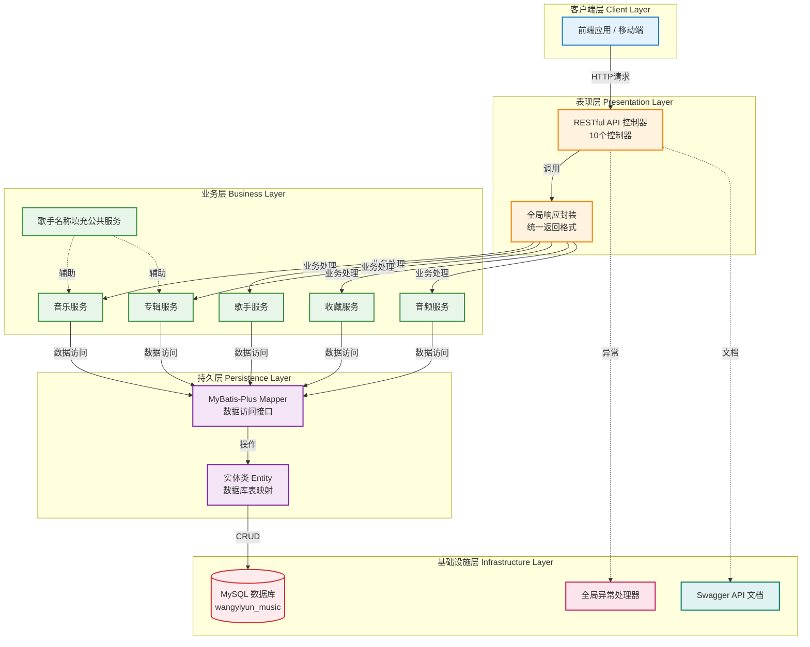

# 网易云音乐项目 (wangyiyun-music)

> 🎵 基于 Spring Boot 的网易云音乐后端服务系统

**文档生成时间**: 2026-01-30 00:01:24
**项目版本**: 0.0.1-SNAPSHOT
**技术栈**: Spring Boot 3.1.0 + Java 17 + Maven + MySQL + MyBatis-Plus

---

## 📋 项目概览

### 项目愿景
构建一个功能完善的网易云音乐后端服务系统，提供音乐播放、歌手管理、专辑管理、收藏互动等核心功能，采用现代化的分层架构设计。

### 核心功能
- ✅ **音乐管理服务**: 歌曲查询、播放URL获取、音乐列表、音乐详情
- ✅ **歌手管理服务**: 歌手信息查询、歌手作品列表
- ✅ **专辑管理服务**: 专辑信息查询、专辑歌曲列表
- ✅ **收藏管理服务**: 用户收藏歌曲、收藏列表管理
- ✅ **播放记录服务**: 播放历史记录、播放统计
- ✅ **分类标签服务**: 音乐分类、标签管理
- ✅ **音频资源服务**: 音频文件URL映射、支持HTTP Range请求

### 技术选型说明
- **框架**: Spring Boot 3.1.0 - 简化 Spring 应用开发，提供开箱即用的功能
- **语言**: Java 17 - 现代化的 Java 特性，提升开发效率
- **构建工具**: Maven - 项目依赖管理和构建自动化
- **数据库**: MySQL - 关系型数据库，存储核心业务数据
- **ORM框架**: MyBatis-Plus 3.5.5 - 强大的 MyBatis 增强工具
- **连接池**: Druid 1.2.21 - 阿里巴巴数据库连接池
- **API文档**: SpringDoc OpenAPI 2.3.0 - 自动生成 Swagger 文档
- **开发环境**: IntelliJ IDEA (推荐)

### 项目状态
- ✅ **已完成**: 基础框架搭建、分层架构设计、核心业务模块开发
- ✅ **已完成**: 统一响应封装、全局异常处理、Swagger API 文档
- ✅ **已完成**: 音频资源URL映射功能
- 🚧 **进行���**: 功能优化与测试完善
- 📅 **待开发**: 用户认证授权、缓存集成、性能优化

---

## 🏗️ 架构设计

### 系统架构图



### 技术栈详情

| 层级 | 技术组件 | 版本 | 说明 |
|------|---------|------|------|
| **表现层** | Spring MVC | 3.1.0 | RESTful API 控制器 |
| **表现层** | SpringDoc OpenAPI | 2.3.0 | 自动生成 Swagger 文档 |
| **业务层** | Spring Service | 3.1.0 | 业务逻辑处理和事务管理 |
| **持久层** | MyBatis-Plus | 3.5.5 | ORM 框架，增强 MyBatis |
| **持久层** | Druid | 1.2.21 | 阿里巴巴数据库连接池 |
| **数据库** | MySQL | 8.0+ | 关系型数据库 |
| **工具** | Lombok | - | 简化 Java 代码 |
| **工具** | FastJson2 | 2.0.43 | JSON 处理 |
| **工具** | Validation | - | 参数校验 |
| **测试** | JUnit 5 + Mockito | - | 单元测试和集成测试 |

### 数据流设计

```
客户端请求 → Controller (接收请求、参数校验)
           → GlobalResponseAdvice (统一响应封装)
           → Service (业务逻辑处理)
           → Mapper (MyBatis-Plus 数据访问)
           → MySQL (数据库持久化)
           → 响应返回 (统一Result格式)
           ↓
异常处理 → GlobalExceptionHandler (捕获、记录、返回错误响应)
```

---

## 📦 模块索引

### 1. Controller 层 (Web 控制层) ✅

**路径**: `src/main/java/com/naruto/wangyiyunmusic/controller/`
**职责**: 接收 HTTP 请求，调用 Service 层处理业务，返回响应数据
**文件数量**: 10个

**主要控制器**:
- [MusicController.java](src/main/java/com/naruto/wangyiyunmusic/controller/MusicController.java) - 音乐管理控制器
  - `GET /api/music/list` - 获取音乐列表（分页）
  - `GET /api/music/{id}` - 获取音乐详情
- [ArtistController.java](src/main/java/com/naruto/wangyiyunmusic/controller/ArtistController.java) - 歌手管理控制器
  - `GET /api/artist/{id}` - 获取歌手详情
- [AlbumController.java](src/main/java/com/naruto/wangyiyunmusic/controller/AlbumController.java) - 专辑管理控制器
  - `GET /api/album/{id}` - 获取专辑详情
- [FavoriteController.java](src/main/java/com/naruto/wangyiyunmusic/controller/FavoriteController.java) - 收藏管理控制器
- [PlayRecordController.java](src/main/java/com/naruto/wangyiyunmusic/controller/PlayRecordController.java) - 播放记录控制器
- [AudioController.java](src/main/java/com/naruto/wangyiyunmusic/controller/AudioController.java) - 音频资源控制器 ⭐新增
  - `GET /api/audio/{musicId}` - 获取音频访问URL（支持HTTP Range请求）
- 其他控制器：CategoryController, TagController, MusicArtistController, MusicTagController

---

### 2. Service 层 (业务逻辑层) ✅

**路径**: `src/main/java/com/naruto/wangyiyunmusic/service/`
**职责**: 实现核心业务逻辑、处理事务管理、调用 Mapper 层访问数据
**文件数量**: 23个（接口+实现）

**主要服务**:
- [MusicService.java](src/main/java/com/naruto/wangyiyunmusic/service/MusicService.java) - 音乐服务接口
- [MusicServiceImpl.java](src/main/java/com/naruto/wangyiyunmusic/service/impl/MusicServiceImpl.java) - 音乐服务实现
- [ArtistService.java](src/main/java/com/naruto/wangyiyunmusic/service/ArtistService.java) - 歌手服务
- [AlbumService.java](src/main/java/com/naruto/wangyiyunmusic/service/AlbumService.java) - 专辑服务
- [FavoriteService.java](src/main/java/com/naruto/wangyiyunmusic/service/FavoriteService.java) - 收藏服务
- [AudioService.java](src/main/java/com/naruto/wangyiyunmusic/service/AudioService.java) - 音频服务接口 ⭐新增
- [AudioServiceImpl.java](src/main/java/com/naruto/wangyiyunmusic/service/impl/AudioServiceImpl.java) - 音频服务实现 ⭐新增
  - 实现音频URL拼接逻辑
  - 支持HTTP Range请求（拖拽播放）
  - 异常处理（音乐不存在、文件不存在）
- [ArtistNameService.java](src/main/java/com/naruto/wangyiyunmusic/service/ArtistNameService.java) - 歌手名称填充公共服务
  - 消除重复代码，统一处理歌手名称填充逻辑

---

### 3. Mapper 层 (数据访问层) ✅

**路径**: `src/main/java/com/naruto/wangyiyunmusic/mapper/`
**职责**: 封装数据库 CRUD 操作，使用 MyBatis-Plus 增强
**技术**: MyBatis-Plus 3.5.5

**主要 Mapper**:
- [MusicMapper.java](src/main/java/com/naruto/wangyiyunmusic/mapper/MusicMapper.java) - 音乐数据访问
- [ArtistMapper.java](src/main/java/com/naruto/wangyiyunmusic/mapper/ArtistMapper.java) - 歌手数据访问
- [AlbumMapper.java](src/main/java/com/naruto/wangyiyunmusic/mapper/AlbumMapper.java) - 专辑数据访问
- [FavoriteMapper.java](src/main/java/com/naruto/wangyiyunmusic/mapper/FavoriteMapper.java) - 收藏数据访问
- 其他 Mapper：CategoryMapper, TagMapper, MusicArtistMapper, MusicTagMapper, PlayRecordMapper

---

### 4. Model 层 (数据模型) ✅

**路径**: `src/main/java/com/naruto/wangyiyunmusic/model/`
**职责**: 定义数据库实体类、数据传输对象、视图对象

#### 4.1 Entity (实体类)
**路径**: `model/entity/`
**文件数量**: 9个

**主要实体**:
- [Music.java](src/main/java/com/naruto/wangyiyunmusic/model/entity/Music.java) - 音乐实体
- [Artist.java](src/main/java/com/naruto/wangyiyunmusic/model/entity/Artist.java) - 歌手实体
- [Album.java](src/main/java/com/naruto/wangyiyunmusic/model/entity/Album.java) - 专辑实体
- [Favorite.java](src/main/java/com/naruto/wangyiyunmusic/model/entity/Favorite.java) - 收藏实体
- [PlayRecord.java](src/main/java/com/naruto/wangyiyunmusic/model/entity/PlayRecord.java) - 播放记录实体
- [Tag.java](src/main/java/com/naruto/wangyiyunmusic/model/entity/Tag.java) - 标签实体
- [Category.java](src/main/java/com/naruto/wangyiyunmusic/model/entity/Category.java) - 分类实体
- [MusicArtist.java](src/main/java/com/naruto/wangyiyunmusic/model/entity/MusicArtist.java) - 音乐-歌手关联实体
- [MusicTag.java](src/main/java/com/naruto/wangyiyunmusic/model/entity/MusicTag.java) - 音乐-标签关联实体

#### 4.2 VO (视图对象)
**路径**: `model/vo/`

**主要 VO**:
- [MusicListVO.java](src/main/java/com/naruto/wangyiyunmusic/model/vo/MusicListVO.java) - 音乐列表视图对象
- [MusicDetailVO.java](src/main/java/com/naruto/wangyiyunmusic/model/vo/MusicDetailVO.java) - 音乐详情视图对象
- [ArtistVO.java](src/main/java/com/naruto/wangyiyunmusic/model/vo/ArtistVO.java) - 歌手视图对象
- [FavoriteVO.java](src/main/java/com/naruto/wangyiyunmusic/model/vo/FavoriteVO.java) - 收藏视图对象
- [AudioUrlVO.java](src/main/java/com/naruto/wangyiyunmusic/model/vo/AudioUrlVO.java) - 音频URL视图对象 ⭐新增

#### 4.3 DTO (数据传输对象)
**路径**: `model/dto/`

**主要 DTO**:
- [MusicQueryDTO.java](src/main/java/com/naruto/wangyiyunmusic/model/dto/MusicQueryDTO.java) - 音乐查询参数对象
- [PlayRecordDTO.java](src/main/java/com/naruto/wangyiyunmusic/model/dto/PlayRecordDTO.java) - 播放记录传输对象

---

### 5. Config 层 (配置类) ✅

**路径**: `src/main/java/com/naruto/wangyiyunmusic/config/`
**职责**: Spring 配置类、静态资源配置、Swagger配置

**主要配置**:
- [MybatisPlusConfig.java](src/main/java/com/naruto/wangyiyunmusic/config/MybatisPlusConfig.java) - MyBatis-Plus 配置
  - 分页插件配置
  - 乐观锁插件配置
- [OpenApiConfig.java](src/main/java/com/naruto/wangyiyunmusic/config/OpenApiConfig.java) - OpenAPI/Swagger 配置
  - API 文档自动生成
  - 接口分组管理
- [WebMvcConfig.java](src/main/java/com/naruto/wangyiyunmusic/config/WebMvcConfig.java) - Web MVC 配置
  - Swagger UI 静态资源映射
  - 音频文件静态资源映射 ⭐新增
  - 支持HTTP Range请求（实现拖拽播放）

---

### 6. Exception 层 (异常处理) ✅

**路径**: `src/main/java/com/naruto/wangyiyunmusic/exception/`
**职责**: 自定义业务异常、全局异常处理器、统一错误响应

**主要类**:
- [BusinessException.java](src/main/java/com/naruto/wangyiyunmusic/exception/BusinessException.java) - 业务异常基类
- [GlobalExceptionHandler.java](src/main/java/com/naruto/wangyiyunmusic/exception/GlobalExceptionHandler.java) - 全局异常处理器
  - 统一捕获业务异常
  - 统一返回错误响应格式
  - 记录异常日志

---

### 7. Common 层 (公共类) ✅

**路径**: `src/main/java/com/naruto/wangyiyunmusic/common/`
**职责**: 通用工具类、常量定义

**主要类**:
- [Result.java](src/main/java/com/naruto/wangyiyunmusic/common/Result.java) - 统一响应封装类
  - code: 响应状态码
  - message: 响应消息
  - data: 响应数据

---

### 8. Annotation 层 (自定义注解) ✅

**路径**: `src/main/java/com/naruto/wangyiyunmusic/annotation/`
**职责**: 自定义注解，用于AOP或参数校验

**主要注解**:
- [IgnoreResponseWrap.java](src/main/java/com/naruto/wangyiyunmusic/annotation/IgnoreResponseWrap.java) - 忽略响应封装注解
  - 用于标记不需要统一响应封装的接口

---

### 9. Application 启动类 ✅

**路径**: `src/main/java/com/naruto/wangyiyunmusic/`
**文件**: [WangyiyunMusicApplication.java](src/main/java/com/naruto/wangyiyunmusic/WangyiyunMusicApplication.java)
**说明**: Spring Boot 应用主入口，使用 `@SpringBootApplication` 注解

---

### 10. 配置文件 ✅

**路径**: `src/main/resources/`
**文件**: [application.yaml](src/main/resources/application.yaml)

**主要配置项**:
- 服务器端口: `8910`
- 数据库连接: MySQL (Druid连接池)
- MyBatis-Plus: 分页插件、日志配置
- SpringDoc OpenAPI: API文档配置
- 音频文件配置: ⭐新增
  - 音频存储路径: `file:D:/music-data/audio/`
  - 访问URL前缀: `/audio/`
  - 服务器基础URL: `http://localhost:${server.port}`

---

## 🔧 开发规范

### 代码风格
遵循《阿里巴巴 Java 开发手册》规范：
- ✅ 使用 4 个空格缩进，禁止使用 Tab
- ✅ 大括号与关键字在同一行
- ✅ 方法参数、运算符两侧必须有空格
- ✅ 避免过长的方法（建议不超过 80 行）
- ✅ 使用 Lombok 简化代码（@Data, @Slf4j, @Service等）

### 命名约定

| 类型 | 规范 | 示例 |
|------|------|------|
| **类名** | 大驼峰命名 (UpperCamelCase) | `MusicService`, `AudioController` |
| **方法名** | 小驼峰命名 (lowerCamelCase) | `getMusicById()`, `buildAudioUrl()` |
| **常量** | 全大写下划线分隔 | `MAX_PAGE_SIZE`, `DEFAULT_TIMEOUT` |
| **包名** | 全小写 | `com.naruto.wangyiyunmusic.service` |
| **变量** | 小驼峰命名 | `musicId`, `audioUrl` |

### 包结构规范
```
com.naruto.wangyiyunmusic
├── annotation      # 自定义注解
├── common         # 公共类
├── config         # 配置类
├── controller     # 控制器层
├── exception      # 异常类
├── mapper         # 数据访问层（MyBatis-Plus）
├── model          # 数据模型
│   ├── entity     # 实体类
│   ├── dto        # 数据传输对象
│   └── vo         # 视图对象
└── service        # 业务逻辑层
    └── impl       # 实现类
```

### 注释规范
- ✅ **使用中文注释** (项目团队统一使用中文)
- ✅ 所有类必须有类级别注释 (包含作者、创建时间、功能说明)
- ✅ 公共方法必须有方法注释 (包含参数说明、返回值说明)
- ✅ 复杂逻辑必须有行内注释

**类注释模板**:
```java
/**
 * 音频服务实现类
 *
 * <p>处理音频文件URL获取相关业务逻辑</p>
 *
 * @Author: naruto
 * @CreateTime: 2026-01-28
 */
@Slf4j
@Service
public class AudioServiceImpl implements AudioService {
    // ...
}
```

**方法注释模板**:
```java
/**
 * 根据音乐ID获取音频访问URL
 *
 * @param musicId 音乐ID
 * @return 音频URL信息
 */
@Override
public AudioUrlVO getAudioUrl(Long musicId) {
    // ...
}
```

### RESTful API 设计规范

| 操作 | HTTP 方法 | 路径示例 | 说明 |
|------|----------|---------|------|
| 查询列表 | GET | `/api/music/list` | 获取音乐列表 |
| 查询单个 | GET | `/api/music/{id}` | 获取音乐详情 |
| 创建 | POST | `/api/favorite` | 添加收藏 |
| 更新 | PUT | `/api/music/{id}` | 更新音乐信息 |
| 删除 | DELETE | `/api/favorite/{id}` | 取消收藏 |

**响应格式**（统一 Result 封装）:
```json
{
  "code": 200,
  "message": "操作成功",
  "data": { ... }
}
```

**错误响应格式**:
```json
{
  "code": 500,
  "message": "音乐不存在，ID: 1",
  "data": null
}
```

---

## 🚀 快速开始

### 环境要求
- ☑️ **JDK**: 17 或更高版本
- ☑️ **Maven**: 3.6+
- ☑️ **MySQL**: 8.0+
- ☑️ **IDE**: IntelliJ IDEA (推荐，已配置 Lombok 插件)

### 安装依赖
```bash
mvn clean install
```

### 构建命令
```bash
# 编译项目
mvn clean compile

# 打包项目
mvn clean package

# 跳过测试打包
mvn clean package -DskipTests
```

### 运行命令

**方式 1: Maven 命令运行**
```bash
mvn spring-boot:run
```

**方式 2: JAR 包运行**
```bash
java -jar target/wangyiyun-music-0.0.1-SNAPSHOT.jar
```

**方式 3: IDE 运行**
- 在 IntelliJ IDEA 中找到 `WangyiyunMusicApplication.java`
- 右键 → Run 'WangyiyunMusicApplication'

### 测试命令
```bash
# 运行所有测试
mvn test

# 运行单个测试类
mvn test -Dtest=MusicServiceTest

# 运行测试并生成覆盖率报告
mvn clean test jacoco:report
```

### 访问应用
- **应用端口**: http://localhost:8910
- **Swagger API 文档**: http://localhost:8910/swagger-ui/index.html
- **API 文档 JSON**: http://localhost:8910/v3/api-docs

---

## 📚 依赖管理

### 核心依赖说明

| 依赖 | 版本 | 说明 | 状态 |
|------|------|------|------|
| **spring-boot-starter-web** | 3.1.0 | Web 应用开发，包含 Spring MVC | ✅ 已集成 |
| **mybatis-plus-boot-starter** | 3.5.5 | MyBatis-Plus 核心库 | ✅ 已集成 |
| **druid-spring-boot-starter** | 1.2.21 | 阿里巴巴数据库连接池 | ✅ 已集成 |
| **mysql-connector-j** | runtime | MySQL 数据库驱动 | ✅ 已集成 |
| **springdoc-openapi-starter-webmvc-ui** | 2.3.0 | Swagger API 文档生成 | ✅ 已集成 |
| **lombok** | - | 简化 Java 代码 | ✅ 已集成 |
| **spring-boot-starter-validation** | - | 参数校验 | ✅ 已集成 |
| **fastjson2** | 2.0.43 | JSON 处理 | ✅ 已集成 |
| **spring-boot-starter-test** | 3.1.0 | 测试框架，包含 JUnit 5、Mockito | ✅ 已集成 |

### 待集成依赖

以下依赖可根据需要在后续开发中集成：

```xml
<!-- Spring Security - 认证授权 -->
<dependency>
    <groupId>org.springframework.boot</groupId>
    <artifactId>spring-boot-starter-security</artifactId>
</dependency>

<!-- Redis - 缓存 -->
<dependency>
    <groupId>org.springframework.boot</groupId>
    <artifactId>spring-boot-starter-data-redis</artifactId>
</dependency>

<!-- Spring Boot Actuator - 健康检查 -->
<dependency>
    <groupId>org.springframework.boot</groupId>
    <artifactId>spring-boot-starter-actuator</artifactId>
</dependency>
```

### 版本管理策略
- ✅ 使用 Spring Boot 的依赖管理机制 (`spring-boot-dependencies`)
- ✅ 锁定主要依赖的版本号，避免意外升级
- ✅ 定期检查依赖安全漏洞 (`mvn dependency:tree`)
- ✅ 优先使用 Spring Boot 官方 Starter

---

## 📖 开发指南

### 数据库配置
在 `application.yaml` 中已配置 MySQL 连接：

```yaml
spring:
  datasource:
    type: com.alibaba.druid.pool.DruidDataSource
    driver-class-name: com.mysql.cj.jdbc.Driver
    url: jdbc:mysql://localhost:3306/wangyiyun_music?useUnicode=true&characterEncoding=utf8&serverTimezone=Asia/Shanghai
    username: root
    password: your_password
```

### 音频文件配置 ⭐新增
```yaml
audio:
  # 音频文件存储的物理路径
  storage-path: file:D:/music-data/audio/
  # 访问URL前缀
  url-prefix: /audio/
  # 服务器基础URL
  server-base-url: http://localhost:${server.port}
```

### 开发工作流
1. **创建分支**: `git checkout -b feature/your-feature`
2. **编写代码**: 遵循开发规范和分层架构
3. **编写测试**: 确保测试覆盖率 > 80%
4. **本地验证**: `mvn clean test`
5. **提交代码**: `git commit -m "feat: 添加XXX功能"`
6. **推送分支**: `git push origin feature/your-feature`
7. **创建 PR**: 等待代码审查

### 日志规范
使用 SLF4J + Logback 记录日志：

```java
import lombok.extern.slf4j.Slf4j;

@Slf4j
@Service
public class AudioServiceImpl implements AudioService {
    public AudioUrlVO getAudioUrl(Long musicId) {
        log.info("获取音频URL请求, musicId: {}", musicId);

        // 业务逻辑

        log.info("音频URL生成成功, musicId: {}, audioUrl: {}", musicId, audioUrl);
        return vo;
    }
}
```

### API 文档访问
启动应用后，访问 Swagger UI 查看所有接口文档：
- **Swagger UI**: http://localhost:8910/swagger-ui/index.html
- **接口测试**: 可直接在 Swagger UI 中测试接口
- **接口说明**: 每个接口都有完整的参数说明和示例

---

## 🔍 项目元数据

- **仓库地址**: (待添加)
- **文档生成时间**: 2026-01-30 00:01:24
- **最后更新**: 2026-01-30
- **维护者**: naruto
- **许可证**: (待定义)
- **Java 文件总数**: 67个
- **控制器数量**: 10个
- **服务类数量**: 23个
- **实体类数量**: 9个

---

## 📌 相关链接

- [Spring Boot 官方文档](https://spring.io/projects/spring-boot)
- [MyBatis-Plus 官方文档](https://baomidou.com/)
- [SpringDoc OpenAPI 文档](https://springdoc.org/)
- [阿里巴巴 Java 开发手册](https://github.com/alibaba/p3c)
- [MySQL 官方文档](https://dev.mysql.com/doc/)
- [Maven 官方文档](https://maven.apache.org/guides/)
- [Druid 官方文档](https://github.com/alibaba/druid)

---

## 📝 更新日志

### 2026-01-30
- ✅ 增量更新项目 AI 上下文文档
- ✅ 添加音频文件URL映射模块文档
- ✅ 生成详细的系统架构图（Mermaid）
- ✅ 更新技术栈信息（反映已集成依赖）
- ✅ 更新模块索引（反映实际实现状态）
- ✅ 添加代码优化示例（歌手名称填充服务）

### 2026-01-28
- ✅ 实现音频文件URL映射接口功能
- ✅ 配置音频静态资源映射（支持HTTP Range请求）
- ✅ 添加音频服务层和控制器

### 2026-01-24
- ✅ 初始化项目 AI 上下文文档
- ✅ 创建项目基础架构
- ✅ 添加测试控制器
- ✅ 配置服务器端口 8910

---

**说明**: 本文档由 AI 自动生成并增量更新，用于辅助项目开发和代码理解。随着项目发展，请及时更新本文档。
