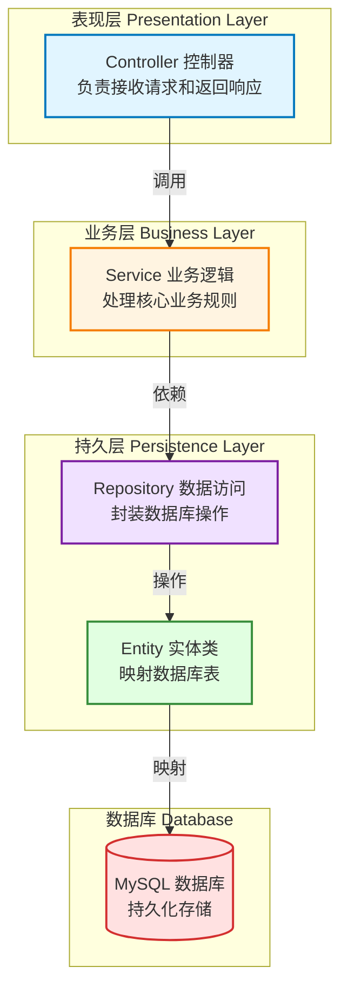

# 网易云音乐项目 (wangyiyun-music)

> 🎵 基于 Spring Boot 的网易云音乐后端服务系统

**文档生成时间**: 2026-01-24 15:33:41
**项目版本**: 0.0.1-SNAPSHOT
**技术栈**: Spring Boot 3.1.0 + Java 17 + Maven + MySQL

---

## 📋 项目概览

### 项目愿景
构建一个功能完善的网易云音乐后端服务系统，提供音乐播放、用户管理、歌单管理、评论互动等核心功能，采用现代化的微服务架构设计。

### 核心功能规划
- 🎧 **音乐播放服务**: 歌曲搜索、播放、收藏、历史记录
- 👤 **用户管理**: 注册登录、个人资料、用户认证授权
- 📝 **歌单管理**: 创建歌单、编辑歌单、分享歌单
- 💬 **评论互动**: 歌曲评论、点赞、回复
- 🔍 **搜索服务**: 歌曲搜索、歌手搜索、专辑搜索
- 📊 **数据统计**: 播放量统计、热门排行榜

### 技术选型说明
- **框架**: Spring Boot 3.1.0 - 简化 Spring 应用开发，提供开箱即用的功能
- **语言**: Java 17 - 现代化的 Java 特性，提升开发效率
- **构建工具**: Maven - 项目依赖管理和构建自动化
- **数据库**: MySQL - 关系型数据库，存储核心业务数据
- **开发环境**: IntelliJ IDEA (推荐)

### 项目状态
- ✅ **已完成**: 基础框架搭建、测试控制器
- 🚧 **进行中**: 分层架构设计
- 📅 **待开发**: 业务逻辑层、数据访问层、实体模型

---

## 🏗️ 架构设计

### 分层架构图



### 技术栈详情

| 层级 | 技术组件 | 说明 |
|------|---------|------|
| **表现层** | Spring MVC | RESTful API 控制器 |
| **业务层** | Spring Service | 业务逻辑处理和事务管理 |
| **持久层** | Spring Data JPA / MyBatis | ORM 框架（待选型） |
| **数据库** | MySQL 8.0+ | 关系型数据库 |
| **安全** | Spring Security (待集成) | 认证授权 |
| **缓存** | Redis (待集成) | 数据缓存 |
| **测试** | JUnit 5 + Mockito | 单元测试和集成测试 |

### 数据流设计

```
客户端请求 → Controller (参数校验)
           → Service (业务处理)
           → Repository (数据访问)
           → Database (持久化)
           → 响应返回
```

---

## 📦 模块索引

### 已实现模块

#### 1. Controller 层 (Web 控制层)
**路径**: `src/main/java/com/naruto/wangyiyunmusic/controller/`
**职责**: 接收 HTTP 请求，调用 Service 层处理业务，返回响应数据
**现有文件**:
- [TestController.java](src/main/java/com/naruto/wangyiyunmusic/controller/TestController.java) - 测试控制器
  - 端点: `GET /test/test` - 返回测试字符串

#### 2. Application 启动类
**路径**: `src/main/java/com/naruto/wangyiyunmusic/`
**文件**: [WangyiyunMusicApplication.java](src/main/java/com/naruto/wangyiyunmusic/WangyiyunMusicApplication.java)
**说明**: Spring Boot 应用主入口，使用 `@SpringBootApplication` 注解

#### 3. 配置文件
**路径**: `src/main/resources/`
**文件**: [application.yaml](src/main/resources/application.yaml)
**配置项**:
- 服务器端口: `8910`

---

### 待实现模块

#### 4. Service 层 (业务逻辑层) 🚧
**规划路径**: `src/main/java/com/naruto/wangyiyunmusic/service/`
**职责**:
- 实现核心业务逻辑
- 处理事务管理
- 调用 Repository 层访问数据
- 业务参数校验和异常处理

**建议结构**:
```
service/
├── UserService.java          # 用户服务接口
├── impl/
│   └── UserServiceImpl.java  # 用户服务实现
├── MusicService.java         # 音乐服务接口
└── PlaylistService.java      # 歌单服务接口
```

#### 5. Repository 层 (数据访问层) 🚧
**规划路径**: `src/main/java/com/naruto/wangyiyunmusic/repository/`
**职责**:
- 封装数据库 CRUD 操作
- 使用 JPA/MyBatis 进行 ORM 映射
- 提供数据查询方法

**建议结构**:
```
repository/
├── UserRepository.java       # 用户数据访问接口
├── MusicRepository.java      # 音乐数据访问接口
└── PlaylistRepository.java   # 歌单数据访问接口
```

#### 6. Model 层 (实体与 DTO) 🚧
**规划路径**: `src/main/java/com/naruto/wangyiyunmusic/model/`
**职责**:
- 定义数据库实体类 (Entity)
- 定义数据传输对象 (DTO)
- 定义视图对象 (VO)

**建议结构**:
```
model/
├── entity/
│   ├── User.java             # 用户实体
│   ├── Music.java            # 音乐实体
│   └── Playlist.java         # 歌单实体
├── dto/
│   ├── UserDTO.java          # 用户传输对象
│   └── MusicDTO.java         # 音乐传输对象
└── vo/
    └── UserVO.java           # 用户视图对象
```

#### 7. Config 层 (配置类) 🚧
**规划路径**: `src/main/java/com/naruto/wangyiyunmusic/config/`
**职责**:
- Spring 配置类
- 数据源配置
- 安全配置
- 跨域配置

**建议文件**:
- `DataSourceConfig.java` - 数据源配置
- `WebConfig.java` - Web MVC 配置
- `SecurityConfig.java` - 安全配置 (Spring Security)

#### 8. Utils 层 (工具类) 🚧
**规划路径**: `src/main/java/com/naruto/wangyiyunmusic/utils/`
**职责**:
- 通用工具方法
- 常量定义
- 枚举类型

**建议文件**:
- `DateUtils.java` - 日期工具类
- `JsonUtils.java` - JSON 处理工具
- `StringUtils.java` - 字符串工具类

#### 9. Exception 层 (异常处理) 🚧
**规划路径**: `src/main/java/com/naruto/wangyiyunmusic/exception/`
**职责**:
- 自定义业务异常
- 全局异常处理器
- 统一错误响应

**建议文件**:
- `BusinessException.java` - 业务异常基类
- `GlobalExceptionHandler.java` - 全局异常处理器
- `ErrorCode.java` - 错误码枚举

---

## 🔧 开发规范

### 代码风格
遵循《阿里巴巴 Java 开发手册》规范：
- ✅ 使用 4 个空格缩进，禁止使用 Tab
- ✅ 大括号与关键字在同一行
- ✅ 方法参数、运算符两侧必须有空格
- ✅ 避免过长的方法（建议不超过 80 行）

### 命名约定

| 类型 | 规范 | 示例 |
|------|------|------|
| **类名** | 大驼峰命名 (UpperCamelCase) | `UserService`, `MusicController` |
| **方法名** | 小驼峰命名 (lowerCamelCase) | `getUserById()`, `saveMusic()` |
| **常量** | 全大写下划线分隔 | `MAX_PAGE_SIZE`, `DEFAULT_TIMEOUT` |
| **包名** | 全小写 | `com.naruto.wangyiyunmusic.service` |
| **变量** | 小驼峰命名 | `userId`, `musicList` |

### 包结构规范
```
com.naruto.wangyiyunmusic
├── controller      # 控制器层
├── service         # 业务逻辑层
│   └── impl        # 实现类
├── repository      # 数据访问层
├── model           # 数据模型
│   ├── entity      # 实体类
│   ├── dto         # 数据传输对象
│   └── vo          # 视图对象
├── config          # 配置类
├── utils           # 工具类
├── exception       # 异常类
└── constant        # 常量类
```

### 注释规范
- ✅ **使用中文注释** (项目团队统一使用中文)
- ✅ 所有类必须有类级别注释 (包含作者、创建时间、功能说明)
- ✅ 公共方法必须有方法注释 (包含参数说明、返回值说明)
- ✅ 复杂逻辑必须有行内注释

**类注释模板**:
```java
/**
 * 用户服务实现类
 *
 * @Author: naruto
 * @CreateTime: 2026-01-24
 */
```

**方法注释模板**:
```java
/**
 * 根据用户ID查询用户信息
 *
 * @param userId 用户ID
 * @return 用户信息，如果不存在返回null
 */
```

### RESTful API 设计规范

| 操作 | HTTP 方法 | 路径示例 | 说明 |
|------|----------|---------|------|
| 查询列表 | GET | `/api/users` | 获取用户列表 |
| 查询单个 | GET | `/api/users/{id}` | 获取指定用户 |
| 创建 | POST | `/api/users` | 创建新用户 |
| 更新 | PUT | `/api/users/{id}` | 更新用户信息 |
| 删除 | DELETE | `/api/users/{id}` | 删除用户 |

**响应格式**:
```json
{
  "code": 200,
  "message": "success",
  "data": { ... }
}
```

---

## 🚀 快速开始

### 环境要求
- ☑️ **JDK**: 17 或更高版本
- ☑️ **Maven**: 3.6+
- ☑️ **MySQL**: 8.0+ (待配置)
- ☑️ **IDE**: IntelliJ IDEA 推荐 (配置 Lombok 插件)

### 安装依赖
```bash
mvn clean install
```

### 构建命令
```bash
# 编译项目
mvn clean compile

# 打包项目
mvn clean package

# 跳过测试打包
mvn clean package -DskipTests
```

### 运行命令

**方式 1: Maven 命令运行**
```bash
mvn spring-boot:run
```

**方式 2: JAR 包运行**
```bash
java -jar target/wangyiyun-music-0.0.1-SNAPSHOT.jar
```

**方式 3: IDE 运行**
- 在 IntelliJ IDEA 中找到 `WangyiyunMusicApplication.java`
- 右键 → Run 'WangyiyunMusicApplication'

### 测试命令
```bash
# 运行所有测试
mvn test

# 运行单个测试类
mvn test -Dtest=UserServiceTest

# 运行测试并生成覆盖率报告
mvn clean test jacoco:report
```

### 访问应用
- **应用端口**: http://localhost:8910
- **测试接口**: http://localhost:8910/test/test
- **健康检查**: http://localhost:8910/actuator/health (待集成 Spring Boot Actuator)

---

## 📚 依赖管理

### 核心依赖说明

| 依赖 | 版本 | 说明 |
|------|------|------|
| **spring-boot-starter-web** | 3.1.0 | Web 应用开发，包含 Spring MVC |
| **mysql-connector-j** | runtime | MySQL 数据库驱动 |
| **spring-boot-starter-test** | 3.1.0 | 测试框架，包含 JUnit 5、Mockito |

### 待集成依赖
以下依赖建议在后续开发中集成：

```xml
<!-- 数据库 ORM -->
<dependency>
    <groupId>org.springframework.boot</groupId>
    <artifactId>spring-boot-starter-data-jpa</artifactId>
</dependency>

<!-- 数据库连接池 -->
<dependency>
    <groupId>com.alibaba</groupId>
    <artifactId>druid-spring-boot-starter</artifactId>
    <version>1.2.16</version>
</dependency>

<!-- 参数校验 -->
<dependency>
    <groupId>org.springframework.boot</groupId>
    <artifactId>spring-boot-starter-validation</artifactId>
</dependency>

<!-- Lombok 简化代码 -->
<dependency>
    <groupId>org.projectlombok</groupId>
    <artifactId>lombok</artifactId>
    <optional>true</optional>
</dependency>

<!-- JSON 处理 -->
<dependency>
    <groupId>com.alibaba.fastjson2</groupId>
    <artifactId>fastjson2</artifactId>
    <version>2.0.43</version>
</dependency>

<!-- API 文档 -->
<dependency>
    <groupId>org.springdoc</groupId>
    <artifactId>springdoc-openapi-starter-webmvc-ui</artifactId>
    <version>2.2.0</version>
</dependency>
```

### 版本管理策略
- ✅ 使用 Spring Boot 的依赖管理机制 (`spring-boot-dependencies`)
- ✅ 锁定主要依赖的版本号，避免意外升级
- ✅ 定期检查依赖安全漏洞 (`mvn dependency:tree`)
- ✅ 优先使用 Spring Boot 官方 Starter

---

## 📖 开发指南

### 数据库配置 (待完成)
在 `application.yaml` 中配置 MySQL 连接：

```yaml
spring:
  datasource:
    url: jdbc:mysql://localhost:3306/wangyiyun_music?useUnicode=true&characterEncoding=utf8&serverTimezone=Asia/Shanghai
    username: root
    password: your_password
    driver-class-name: com.mysql.cj.jdbc.Driver
```

### 开发工作流
1. **创建分支**: `git checkout -b feature/your-feature`
2. **编写代码**: 遵循开发规范
3. **编写测试**: 确保测试覆盖率 > 80%
4. **本地验证**: `mvn clean test`
5. **提交代码**: `git commit -m "feat: 添加XXX功能"`
6. **推送分支**: `git push origin feature/your-feature`
7. **创建 PR**: 等待代码审查

### 日志规范
使用 SLF4J + Logback 记录日志：

```java
import lombok.extern.slf4j.Slf4j;

@Slf4j
public class UserService {
    public void createUser(User user) {
        log.info("开始创建用户: {}", user.getUsername());
        // 业务逻辑
        log.info("用户创建成功，用户ID: {}", user.getId());
    }
}
```

---

## 🔍 项目元数据

- **仓库地址**: (待添加)
- **文档生成时间**: 2026-01-24 15:33:41
- **最后更新**: 2026-01-24
- **维护者**: naruto
- **许可证**: (待定义)

---

## 📌 相关链接

- [Spring Boot 官方文档](https://spring.io/projects/spring-boot)
- [阿里巴巴 Java 开发手册](https://github.com/alibaba/p3c)
- [MySQL 官方文档](https://dev.mysql.com/doc/)
- [Maven 官方文档](https://maven.apache.org/guides/)

---

## 📝 更新日志

### 2026-01-24
- ✅ 初始化项目 AI 上下文文档
- ✅ 创建项目基础架构
- ✅ 添加测试控制器
- ✅ 配置服务器端口 8910

---

**说明**: 本文档由 AI 自动生成，用于辅助项目开发和代码理解。随着项目发展，请及时更新本文档。
